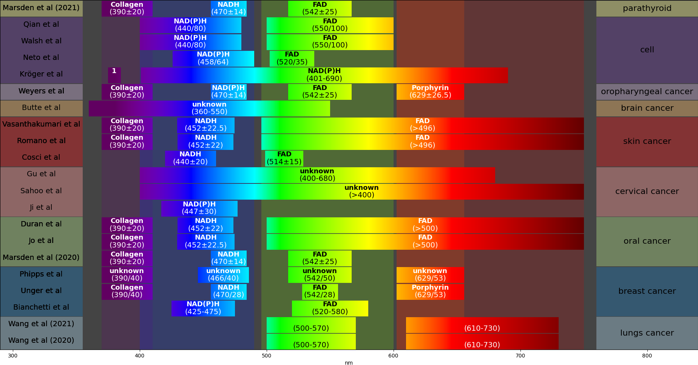

# Spectral-Band-FLIm-Review-Image

Script used to generates the colour images used in __Applications of Machine Learning in time-domain Fluorescence Lifetime Imaging: a Review__, Gouzou et al., 10.1088/2050-6120/ad12f7.  

Python is used with Matplotlib. Required packages are written in the `requirements.txt` file. PyQt5 is used as backend for Matplotlib, but you may need another one. See [https://matplotlib.org/stable/users/explain/figure/backends.html](https://matplotlib.org/stable/users/explain/figure/backends.html).
